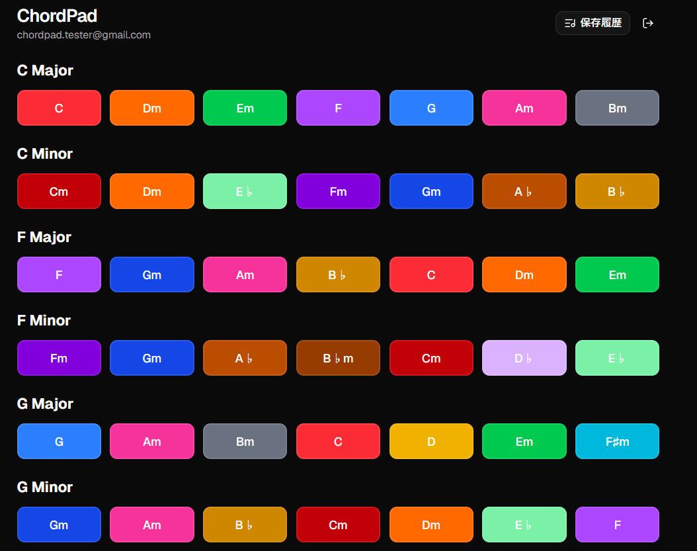

<h1>アプリ概要</h1>
 ワンクリック操作で、和音を簡単に組み立てられるアプリ
<h1>設計ドキュメント</h1>
 [要件定義・基本設計・詳細設計の一覧_Googleスプレッドシート](https://docs.google.com/spreadsheets/d/1a9OvSv8_YOCDU5frkIitncBvOq4bCQJL78d_ViD5lyA/edit?usp=sharing)
<h1>サイトURL</h1>
 https://chordscreate.vercel.app/
<h1>サイトイメージ</h1>

<h1>使用技術</h1>
Next.js、supabase、Tone.js
<h1>機能一覧</h1>
 ・C、F、Gメジャー/マイナーのダイアトニックコードをワンクリックで鳴らす
 ・任意のコードを選択し、コード進行として組み立てる
 ・組み立てたコード進行を再生
 ・気に入ったコード進行を保存し、いつでも再生できる
